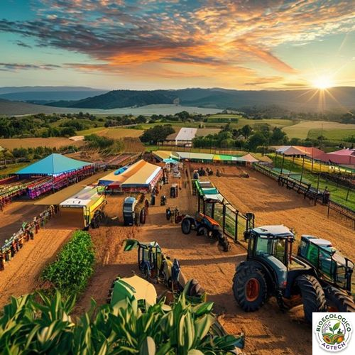
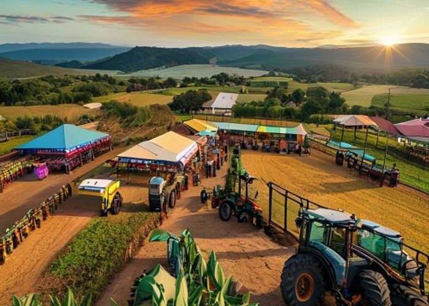

# Expo Agraria 2026: Impulso a Agricultores de Sullana y Piura

## Introducción

## ¿Por qué la Expo Agraria 2026 es clave para el agro de Sullana y Piura?

La **Expo Agraria 2026**, organizada por el Ministerio de Agricultura y la Sociedad Nacional de Agronegocios, llega este junio a la ciudad de Huancayo con una agenda diseñada para los retos actuales del sector peruano. Para los productores de la zona norte —Sullana, Piura, Sechura y sus alrededores— el evento representa una oportunidad única para:

- Acceder a **tecnologías de bajo costo** que aumentan el rendimiento de cultivos como la caña de azúcar, el arroz y los vegetales de exportación.
- Conocer **soluciones de fertilización orgánica** que reducen la dependencia de insumos químicos y mejoran la salud del suelo.
- Intercambiar experiencias con investigadores de la Universidad Nacional de Piura y la Universidad Católica de Santa María, quienes presentarán resultados de proyectos piloto en la zona.

  📑 Tabla de Contenidos

- [Introducción](#introducción)
- [El contexto actual](#el-contexto-actual)
- [Impacto en Sullana/Piura](#impacto-en-sullanapira)
- [Acciones recomendadas](#acciones-recomendadas)
- [Conclusión](#conclusión)

### Datos del sector agropecuario en Sullana y Piura

| Indicador | Valor 2023 | Tendencia 2024‑2025 |
|-----------|------------|---------------------|
| Área agrícola total (ha) | 145,800 | +2 % anual (expansión de cultivos de exportación) |
| Producción de caña de azúcar (ton) | 1.4 M | +4 % con mejoras en riego por goteo |
| Producción de arroz (ton) | 420,000 | Estable, pero con mayor adopción de variedades resistentes a sequía |
| Uso de fertilizantes orgánicos (% del total) | 12 % | Proyección 20 % para 2026 tras incentivos gubernamentales |
| Ingreso promedio por familia agrícola (USD) | 4,200 | +3 % con diversificación de cultivos y valor agregado |

Estos números demuestran que, aunque la región ya es una de las más productivas del país, existe un **potencial de mejora del 15‑20 %** mediante prácticas sostenibles y tecnología adecuada.

## Principales ejes de la Expo que benefician a los productores del norte

### 1. Innovación en fertilización orgánica

Los expositores presentarán **biofertilizantes a base de residuos agroindustriales** (cáscara de arroz, bagazo de caña) y **micorrizas comerciales** que facilitan la absorción de fósforo y nitrógeno. Estudios de la Universidad Nacional de Piura indican que la aplicación de micorrizas en arroz aumenta el rendimiento en un **8‑10 %** y reduce la necesidad de nitrato de amonio en un 30 %.

> *Tip práctico:* Si tu finca tiene más de 5 ha, considera una mezcla 70 % compost de residuos locales + 30 % inoculante micorrízico. Los resultados se ven en 3‑4 ciclos de cultivo.

### 2. Tecnologías de riego inteligente

Se exhibirán **sensores de humedad de suelo IoT** y sistemas de riego por goteo con control remoto vía celular. En la zona de la cuenca del río Piura, agricultores que adoptaron estos sistemas redujeron el consumo de agua en **25‑35 %**, manteniendo o incrementando los rendimientos.

### 3. Maquinaria ligera y modular

Para pequeños y medianos productores, la expo mostrará tractores compactos de 30‑50 HP con **cadenas de distribución híbrida** (eléctrica + diésel) que reducen el consumo de combustible en un 15 % y la huella de carbono.

### 4. Capacitación y transferencia de conocimiento

- **Charlas de la Dirección Regional de Agricultura de Piura** sobre los lineamientos del **Plan Nacional de Fertilización Orgánica 2024‑2028**.
- **Talleres prácticos** de compostaje a escala familiar, con énfasis en la gestión de residuos de la industria azucarera.
- **Mesas redondas** con agricultores exitosos que ya exportan productos orgánicos certificados.

## Cómo prepararse para la Expo y maximizar el retorno de inversión

1. **Define tus objetivos**: ¿Buscas reducir costos de fertilizantes, mejorar el riego o incursionar en la certificación orgánica? Tener una meta clara te permitirá elegir los stands y conferencias relevantes.
2. **Agenda reuniones previas**: La página oficial permite solicitar citas con proveedores y universidades. Programa al menos tres encuentros antes del evento.
3. **Lleva muestras de suelo**: Muchos laboratorios de la expo ofrecen análisis gratuito y recomendaciones personalizadas en el mismo día.
4. **Evalúa la financiación**: El Banco de Desarrollo del Perú y el Programa de Innovación Agrícola (PIA) ofrecen créditos con tasas preferenciales para la compra de tecnologías sostenibles presentadas en la expo.
5. **Comparte tu experiencia**: Después del evento, escribe una breve reseña en grupos de Facebook de agricultores de Sullana. La visibilidad te ayuda a crear alianzas locales.

## Impacto esperado en la región a corto y mediano plazo

- **Incremento del 10‑12 % en la productividad de caña y arroz** si al menos el 30 % de los productores adopta biofertilizantes y riego inteligente.
- **Reducción de emisiones de CO₂ en 5.000 t/año** gracias al menor uso de fertilizantes químicos y combustible.
- **Generación de empleo**: Se estima que la cadena de valor de fertilizantes orgánicos creará alrededor de 1 200 puestos de trabajo directos en la zona norte entre 2026‑2030.
- **Mayor acceso a mercados internacionales**: La certificación orgánica abre puertas a EE.UU., Europa y Asia, donde los precios pueden ser un 20‑30 % superiores al mercado convencional.

## Conclusión: una cita imperdible para el agro de Sullana y Piura

La Expo Agraria 2026 no es solo una vitrina de productos; es una plataforma de **co‑creación** entre científicos, empresarios y agricultores. Para los productores de Sullana y Piura, asistir significa:

- Obtener herramientas concretas para **hacer más rentable la producción**.
- **Reducir costos** y mitigar riesgos climáticos mediante soluciones basadas en la naturaleza.
- **Conectar con financiamiento** y normativa que favorecen la transición a una agricultura sostenible.

Si tu meta es mantener la competitividad de tu finca en los próximos años, **marca el 15‑17 de junio en tu agenda** y prepárate para volver a casa con ideas, contactos y, sobre todo, con la confianza de que la innovación está al alcance de tu campo.

---
*¿Tienes dudas sobre cómo aplicar alguna de las tecnologías mostradas? Déjanos tu comentario y te responderemos con una guía paso a paso adaptada a tu finca.*

## El contexto actual

El sector agrícola peruano, especialmente en zonas como Sullana y Piura, se enfrenta a retos constantemente cambiantes. Este artículo profundiza en cómo podés adaptarte y prosperar en este entorno dinámico.

## Impacto en Sullana/Piura

Para los productores de la región, esto significa:

- **Oportunidades**: Nuevos mercados y métodos más eficientes
- **Desafíos**: Adaptación tecnológica y regulatoria
- **Beneficios a largo plazo**: Mayor rentabilidad y sostenibilidad

## Acciones recomendadas

1. Mantente informado sobre regulaciones nuevas
2. Invierte en capacitación continua
3. Red con otros productores de la zona
4. Considera tecnologías sostenibles y certificación orgánica
5. Participa en comunidades locales de agricultores

## Conclusión

La transformación agrícola es una oportunidad, no una amenaza. En Sullana y Piura tenemos el potencial para liderar esta transformación hacia un agro más sostenible y rentable.

---

**Publicado por:** Bioecológico AgTech  
**Última actualización:** 26 de junio de 2026

**Fuente original:** [Google News](https://news.google.com/rss/articles/CBMi7AFBVV95cUxOcW84RW9UazVfakptcTN2aVZtMFBTdVN5ZVVOU2pZSnhlb0NDYWxMY3BRZ0tPN1lac25qaHpzWWEyM3UwQ0o5RG1lRTU1enUzVkNxd2Z2amhZTTA5MzVlajJGajJUMzFnMHM3ZUhHWC01RGQ5Zk50YVd3V1NwNzRXV1BZNHRaUDVZUmxtS1Vlb1BvMU5lZlkwTU8zZE0xSXY3eVdyUHlfdHRJWExpbi1BTnhydldFYnpLSmQ3b0ZLQ01IN3Jlak5BTW1GZ1ZaSDhOUzFZN0F6U3hQc0RPVElxdFc4QkpZZnR1VWpRaw?oc=5)
